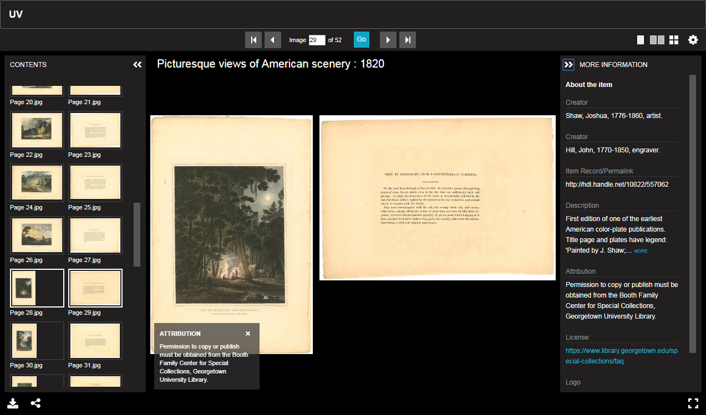
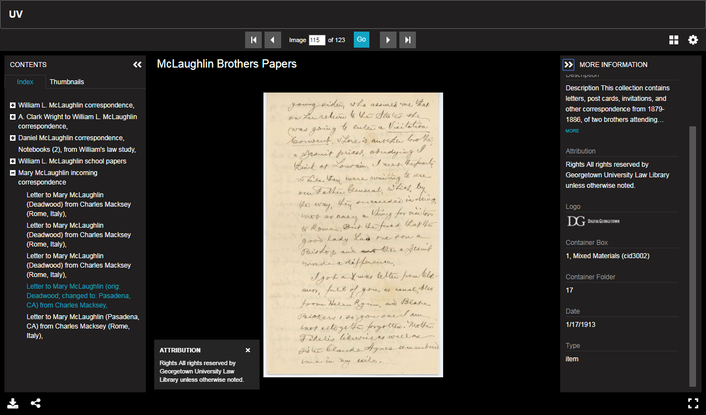
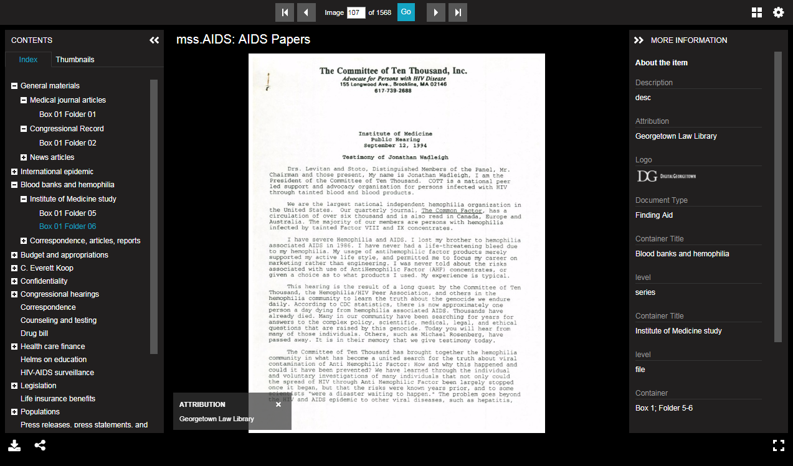
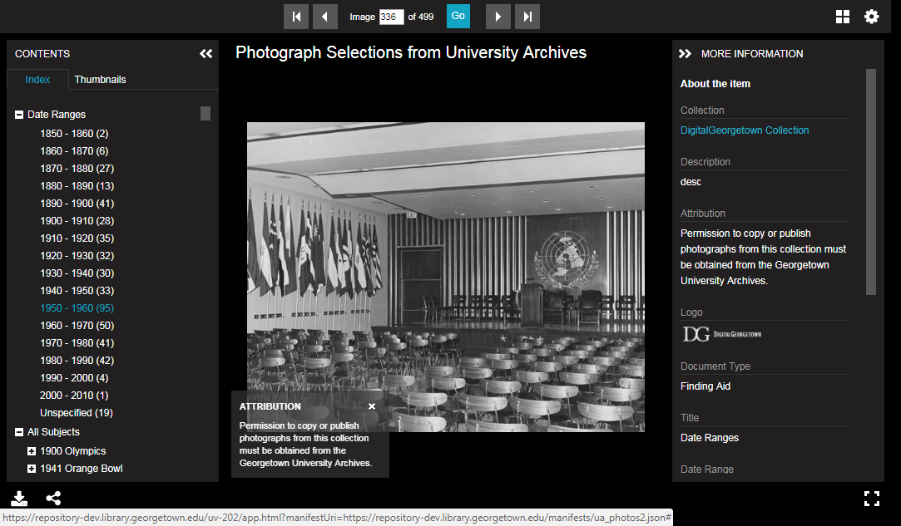
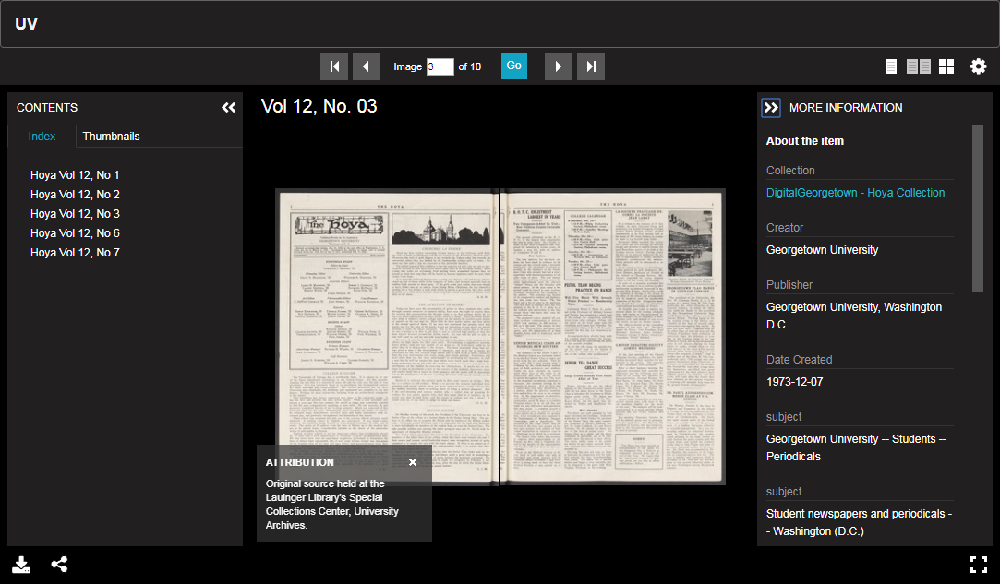

## Gallery of IIIF Manifest Experimentation

### Manuscript with Irregular Page Orientation Generated from PDF Source File

- [Manifest](burst1.json)

### Hierarchical Collection Generated from Archival EAD with Item Level Metadata

- [Manifest](ead.json)
- Inputs 
  - EAD File with item level metadata
  - PDF docements exported as jpg
  - Image paths manually edited into the EAD file
- This manifest was generated from an Archivist Toolkit EAD file [XSLT Transform](eadConv/ead2Manifest.xsl)

### Hierarchical Collection Generated from File System (boxes/folders) and EAD with Minimal Metadata

- [Manifest](ead2.json)
- Inputs
  - 1500 jpg files organized into 4 boxes and approx 100 folders
  - EAD file describing the contents of specific boxes and folders
- This manifest was generated by walking a collection of directories of digitized access
  - Metadata is pulled from an EAD file
  - The contents were linked by box number and file number
- https://github.com/Georgetown-University-Libraries/File-Analyzer/blob/iiif/demo/src/main/edu/georgetown/library/fileAnalyzer/filetest/CreateIIIFManifestEAD.java
- https://github.com/Georgetown-University-Libraries/File-Analyzer/blob/iiif/demo/src/main/edu/georgetown/library/fileAnalyzer/filetest/IIIFManifestEAD.java 

### Photo Gallery Created from DSpace AIP Exports (Subject Index)

-  [Manifest](ua_photos.json)

### Photo Gallery Created from DSpace AIP Exports with Subject and Date Indexes

- [Manifest](ua_photos2.json)
- Inputs
  - 499 DSpace AIP Export folders each containing a Jpg file and item level metadata in mets.xml file
- Generated from DSpace AIP Exports
- https://github.com/Georgetown-University-Libraries/File-Analyzer/blob/iiif/demo/src/main/edu/georgetown/library/fileAnalyzer/filetest/CreateIIIFManifestAIP.java
- https://github.com/Georgetown-University-Libraries/File-Analyzer/blob/iiif/demo/src/main/edu/georgetown/library/fileAnalyzer/filetest/IIIFManifestAIP.java 

### Student Newspapaer Collection (Each Issue in its Own Manifest)

- [Manifest](hoyacoll.json)
- Inputs
  - 5 folders representing an individual issue of the paper each containing
    - 1 tif file per page
    - dublin_core.xml file exported from DSpace
- Each folder was processed individually generating a manifest file
  - Each manifest file was listed in a collection manifest file for the overall collection
- https://github.com/Georgetown-University-Libraries/File-Analyzer/blob/iiif/demo/src/main/edu/georgetown/library/fileAnalyzer/filetest/CreateIIIFManifestDC.java
- https://github.com/Georgetown-University-Libraries/File-Analyzer/blob/iiif/demo/src/main/edu/georgetown/library/fileAnalyzer/filetest/IIIFManifestDC.java 
